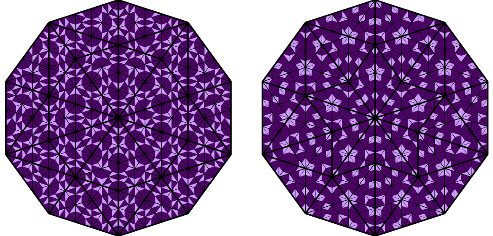

# TriangleTilingsGenerator
Generator of self-similar nonperiodic triangular tilings: Tuebingen triangle tiling (TTT) and Penrose–Robinson triangle tiling (PRT)

## Usage:
    $ ./PRT-TTT.py <image_size> <type> <level>
    image_size: size of a side of output square image, px
    type: PRT - Penrose–Robinson triangle tiling
    or TTT - Tuebingen triangle tiling
    level: level of hierarchy (number of subdivision steps) recommended to be < 12
## Resources:
* Penrose–Robinson triangle tiling: https://tilings.math.uni-bielefeld.de/substitution/robinson-triangle/
* Tuebingen triangle tiling: https://tilings.math.uni-bielefeld.de/substitution/tuebingen-triangle/

